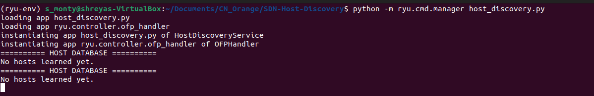
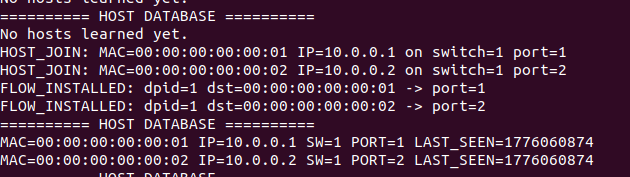
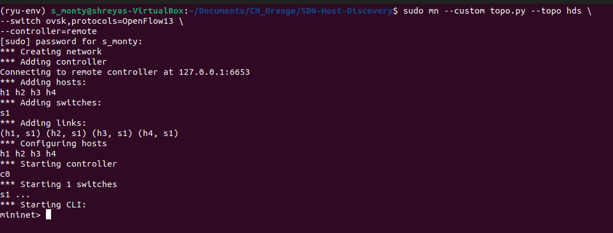
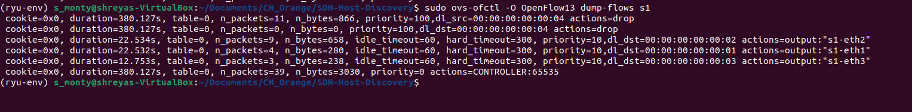
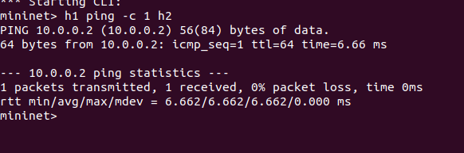
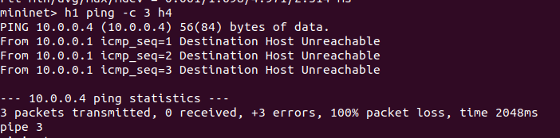
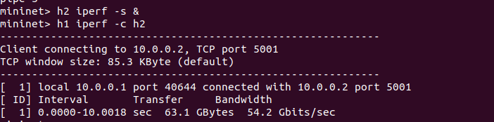
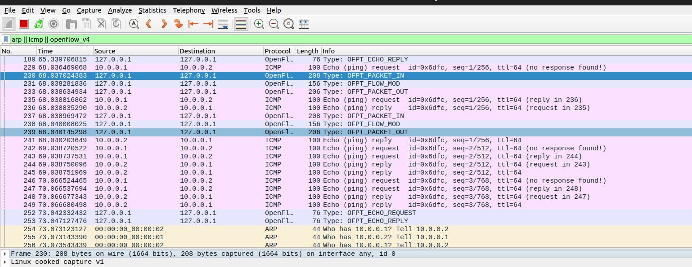
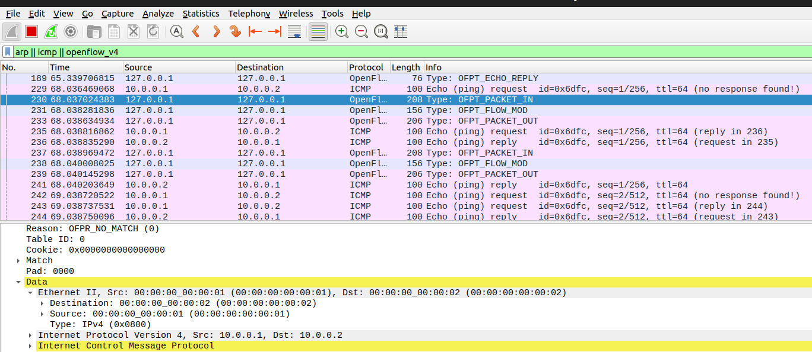

# SDN Host Discovery Service using Ryu Controller

## Problem Statement

The objective of this project is to implement a **Host Discovery Service in a Software Defined Network (SDN)** using Mininet and the Ryu controller.

The system should:

* Automatically detect hosts in the network
* Maintain a dynamic host database
* Install flow rules using match–action logic
* Demonstrate controller–switch interaction
* Support both normal forwarding and blocked traffic scenarios

---

## Objectives

* Implement SDN controller logic using **Ryu**
* Handle `packet_in` events for dynamic learning
* Design and install **OpenFlow flow rules**
* Maintain a **host database**
* Demonstrate:
  * Allowed traffic
  * Blocked traffic
* Analyze performance using **ping and iperf**
* Observe network behavior using **Wireshark**

---

## System Architecture

* **Controller:** Ryu (Python-based SDN controller)
* **Emulator:** Mininet
* **Protocol:** OpenFlow 1.3
* **Topology:** Single switch with 4 hosts

---

## Setup & Execution Steps

### 1. Activate Virtual Environment

```bash
source ryu-env/bin/activate
```

### 2. Run Controller

```bash
python -m ryu.cmd.manager host_discovery.py
```

### 3. Start Mininet

```bash
sudo mn --custom topo.py --topo hds \
--switch ovsk,protocols=OpenFlow13 \
--controller=remote
```

---

## Controller Logic Explanation

### 🔹 Host Discovery

* Controller listens for `packet_in` events
* Extracts:
  * MAC address
  * IP address
  * Switch ID
  * Port
* Stores in a **host database**

---

### Flow Rule Design (Match–Action)

#### 1. Table-Miss Rule (Priority 0)

* Matches all unknown packets
* Action: Send to controller

#### 2. Forwarding Rules (Priority 10)

* Match: `eth_dst`
* Action: Output to correct port
* Installed dynamically

#### 3. Blocking Rules (Priority 100)

* Match: Blocked MAC (h4)
* Action: DROP
* Highest priority

---

## Test Scenarios

### Scenario 1: Normal Traffic (Allowed)

```bash
h1 ping -c 3 h2
```

* Successful communication  
* Flow rules installed dynamically

---

### Scenario 2: Blocked Traffic

```bash
h1 ping -c 3 h4
```

* Ping fails  
* Drop rule enforced

---

## Performance Analysis

### Latency (Ping)

* Measured using `ping`
* Shows successful/failed connectivity

### 🔹 Throughput (iperf)

```bash
h2 iperf -s &
h1 iperf -c h2
```

* Measures bandwidth between hosts

---

### Flow Table Observation

```bash
sudo ovs-ofctl -O OpenFlow13 dump-flows s1
```

Observed:

* Priority 100 → Drop rules
* Priority 10 → Forwarding rules
* Priority 0 → Controller rule

---

## Packet-Level Analysis (Wireshark)

Filter used:

```
arp || icmp || openflow_v4
```

Observed:

* ARP → Host discovery
* ICMP → Ping traffic
* OpenFlow:
  * `OFPT_PACKET_IN`
  * `OFPT_FLOW_MOD`
  * `OFPT_PACKET_OUT`

---

## Proof of Execution

The following evidence is included:

* Controller logs (host discovery & flow installation)


* Mininet topology

* Flow table output

* Successful ping

* Blocked ping

* iperf results

* Wireshark packet capture



---

## Functional Features Implemented

* Host discovery and tracking  
* Dynamic flow rule installation  
* Packet-in handling  
* Blocking/filtering mechanism  
* Network monitoring via logs  
* Performance evaluation  

---

## Key Concepts Demonstrated

* SDN architecture
* Separation of control and data plane
* OpenFlow protocol
* Match–action paradigm
* Dynamic network behavior

---

## Conclusion

This project successfully demonstrates an SDN-based host discovery system using Ryu. The controller dynamically learns hosts, installs flow rules, and enforces access control policies. The behavior is validated using network tools like ping, iperf, and Wireshark, fulfilling all required objectives.